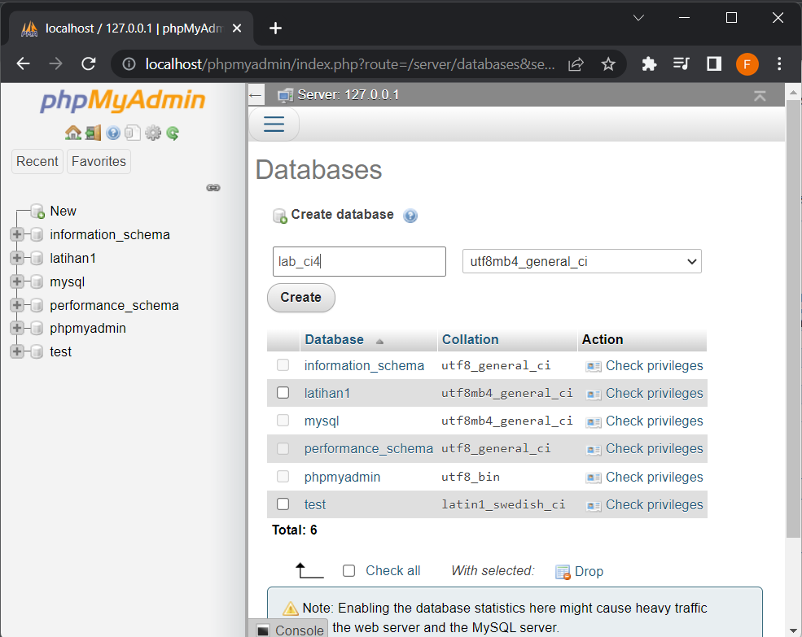
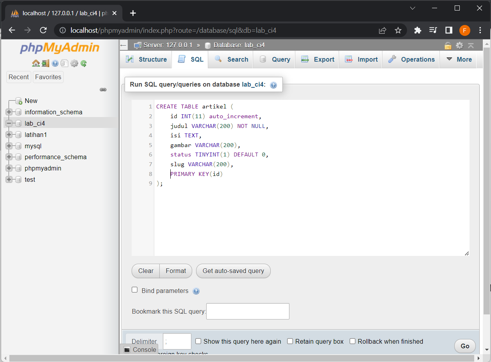
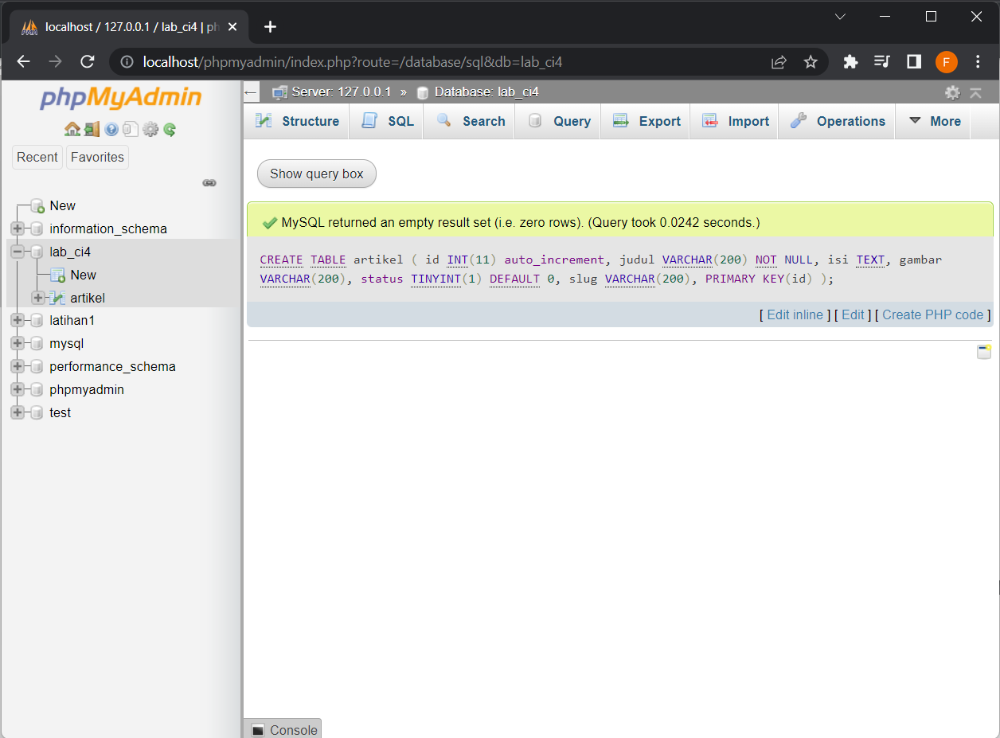
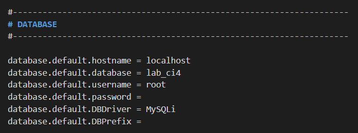

# lab11_ci Praktikum 12
## Lab11 Code Igniter : Framework Lanjutan (CRUD)

<hr>
Nama : Faza Ardan Kusuma<br>
NIM : 312010001<br>
Kelas : TI 20 B1<br>
<hr>

Disini saya mendapatkan tugas dari dosen untuk melanjutkan repository yang sebelumnya untuk melakukan Praktikum yang ke 12. Disini saya akan mempraktekkan CRUD (Create, Read, Update, dan Delete) dalan Code Igniter.<br>
<br>
Saya mulai untuk praktikumnya.<br>

### Membuat Database
Sebelum membuat database, pastikan server MySQL sudah diaktifkan. Kemudian disini saya akan membuat database dengan nama <b>lab_ci4</b>, berikut caranya:<br>


### Membuat Tabel
Setelah membuat database, berikutnya saya membuat tabel.<br>
```
CREATE TABLE artikel ( 
    id INT(11) auto_increment, 
    judul VARCHAR(200) NOT NULL, 
    isi TEXT, 
    gambar VARCHAR(200), 
    status TINYINT(1) DEFAULT 0, 
    slug VARCHAR(200), 
    PRIMARY KEY(id) 
);
```
<br>
Bila sukses membuat tabel maka muncul seperti berikut :<br>
<br>

### Konfigurasi Database
Kemudian membuat konfigurasi untuk menghubungkan dengan database server. Pada file <b>.env</b> saya akan aktifkan konfigurasinya seperti berikut :<br>
<br>
Dalam konfigurasi ini, untuk password saya hilangkan.<br>

### Membuat Model
Kemudian saya akan membuat file baru dengan nama <b>ArtikelModel.php</b> pada direktori <b>App/Models.</b>File ini berisikan syntax berikut :<br>
```
<?php
namespace App\Models;
use CodeIgniter\Model;
class ArtikelModel extends Model
{
    protected $table = 'artikel';
    protected $primaryKey = 'id';
    protected $useAutoIncrement = true;
    protected $allowedFields = ['judul', 'isi', 'status', 'slug', 'gambar'];
}
```

### Membuat Controller
