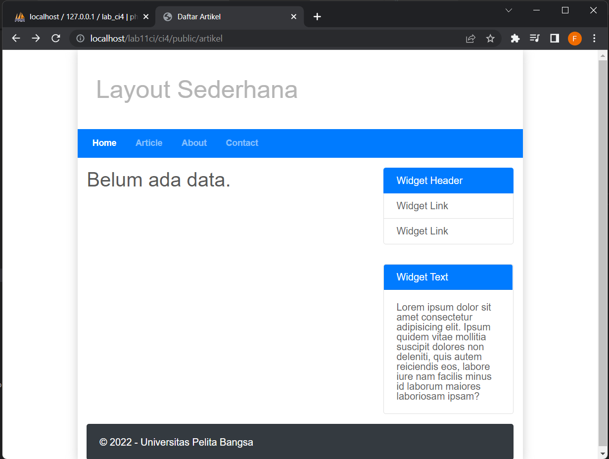
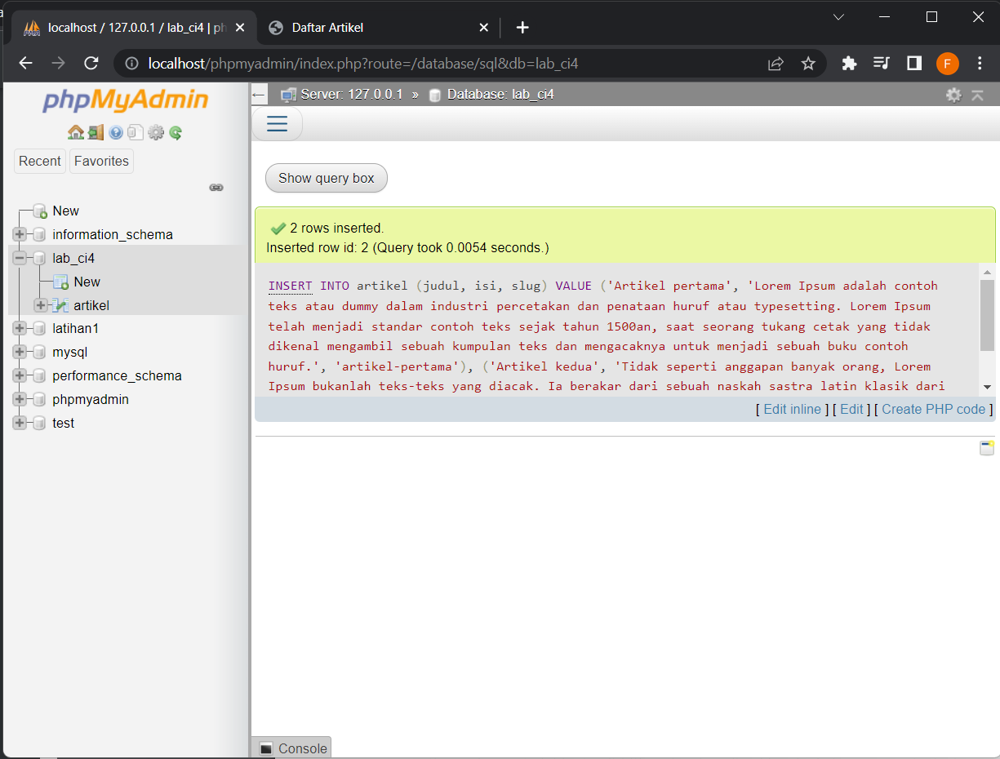
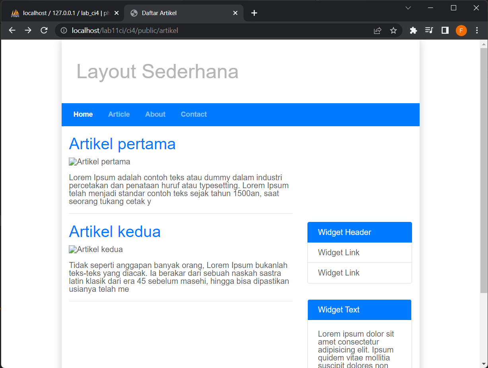
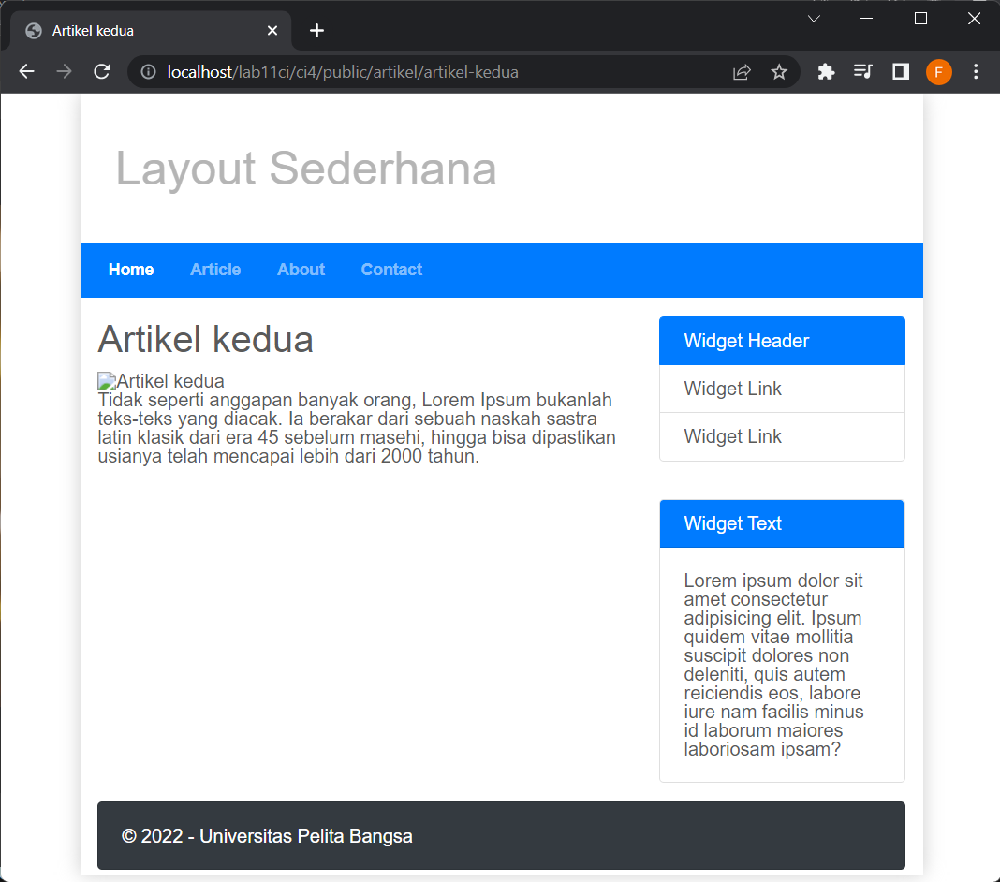

# lab11_ci Praktikum 12
## Lab11 Code Igniter : Framework Lanjutan (CRUD)

<hr>
Nama : Faza Ardan Kusuma<br>
NIM : 312010001<br>
Kelas : TI 20 B1<br>
<hr>

Disini saya mendapatkan tugas dari dosen untuk melanjutkan repository yang sebelumnya untuk melakukan Praktikum yang ke 12. Disini saya akan mempraktekkan CRUD (Create, Read, Update, dan Delete) dalan Code Igniter.<br>
<br>
Saya mulai untuk praktikumnya.<br>

### Membuat Database
Sebelum membuat database, pastikan server MySQL sudah diaktifkan. Kemudian disini saya akan membuat database dengan nama <b>lab_ci4</b>, berikut caranya:<br>


### Membuat Tabel
Setelah membuat database, berikutnya saya membuat tabel.<br>
```
CREATE TABLE artikel ( 
    id INT(11) auto_increment, 
    judul VARCHAR(200) NOT NULL, 
    isi TEXT, 
    gambar VARCHAR(200), 
    status TINYINT(1) DEFAULT 0, 
    slug VARCHAR(200), 
    PRIMARY KEY(id) 
);
```
<br>
Bila sukses membuat tabel maka muncul seperti berikut :<br>
<br>

### Konfigurasi Database
Kemudian membuat konfigurasi untuk menghubungkan dengan database server. Pada file <b>.env</b> saya akan aktifkan konfigurasinya seperti berikut :<br>
<br>
Dalam konfigurasi ini, untuk password saya hilangkan.<br>

### Membuat Model
Kemudian saya akan membuat file baru dengan nama <b>ArtikelModel.php</b> pada direktori <b>App/Models.</b>File ini berisikan syntax berikut :<br>
```
<?php
namespace App\Models;
use CodeIgniter\Model;
class ArtikelModel extends Model
{
    protected $table = 'artikel';
    protected $primaryKey = 'id';
    protected $useAutoIncrement = true;
    protected $allowedFields = ['judul', 'isi', 'status', 'slug', 'gambar'];
}
```

### Membuat Controller
Selanjutnya saya akan membuat controller dengan file baru pada direktori <b>app/Controllers</b> dengan nama <b>Artikel.php</b> dengan syntax berikut :<br>
```
<?php
namespace App\Controllers;
use App\Models\ArtikelModel;
class Artikel extends BaseController
{
    public function index()
    { 
        $title = 'Daftar Artikel';
        $model = new ArtikelModel();
        $artikel = $model->findAll();
        return view('artikel/index', compact('artikel', 'title'));
    }
}
```

### Membuat View
Setelah selesai membuat Controller, saya akan membuat file baru dengan nama <b>index.php</b> pada direktori <b>app/views</b> dengan syntax berikut :<br>
```
<?= $this->include('template/header'); ?>

<?php if($artikel): foreach($artikel as $row): ?>
<div class="col-sm-8">
    <article class="entry">
        <h2><a href="<?= base_url('/artikel/' . $row['slug']);?>"> <?=$row['judul']; ?></a></h2>
        " alt="<?=$row['judul']; ?>">
        <p><br><?= substr($row['isi'], 0, 200); ?></p>
    </article>
    <hr class="divider" />
</div>

<?php endforeach; else: ?>
<div class="col-sm-8">
    <article class="entry">
        <h2>Belum ada data.</h2>
    </article>
</div>
<?php endif; ?>

<?= $this->include('template/footer'); ?>
```
Kemudian saya akan lihat di browser dengan mengakses url artikel tersebut.<br>
<br>

### Memasukkan Data
Disini saya mencoba memasukkan data ke database
```
INSERT INTO artikel (judul, isi, slug) VALUE ('Artikel pertama', 'Lorem Ipsum adalah contoh teks atau dummy dalam industri percetakan dan penataan huruf atau typesetting. Lorem Ipsum telah menjadi standar contoh teks sejak tahun 1500an, saat seorang tukang cetak yang tidak dikenal mengambil sebuah kumpulan teks dan mengacaknya untuk menjadi sebuah buku contoh huruf.', 'artikel-pertama'), ('Artikel kedua', 'Tidak seperti anggapan banyak orang, Lorem Ipsum bukanlah teks-teks yang diacak. Ia berakar dari sebuah naskah sastra latin klasik dari era 45 sebelum masehi, hingga bisa dipastikan usianya telah mencapai lebih dari 2000 tahun.', 'artikel-kedua');
```
Berikut tampilannya :<br>
 <br>

Setelah itu saya refresh halamannya, tampilannya menjadi seperti berikut :<br>


### Membuat Tampilan Artikel Detail
Saya ingin membuat tampilan pada saat judul berita di klik maka akan diarahkan ke halaman yang berbeda. Disini saya mambahkan fungsi baru pada Controller Artikel dengan nama view().
```
public function view($slug)
    {
        $model = new ArtikelModel();
        $artikel = $model->where([
            'slug' => $slug
            ])->first();
            
        // Menampilkan error apabila data tidak ada.
        if (!$artikel)
        { 
            throw PageNotFoundException::forPageNotFound();
        }
        $title = $artikel['judul'];
        return view('artikel/detail', compact('artikel', 'title'));
    }
```

### Membuat View Detail
Setelah itu saya membuat view detail dengan membuat file baru dengan nama detail.php pada direktori app/views/artikel/<br>
```
<?= $this->include('template/header'); ?>

<div class="col-sm-8">
    <article class="entry">
        <h2><?= $artikel['judul']; ?></h2>
        " alt="<?= $artikel['judul']; ?>">
        <p><?= $artikel ['isi']; ?></p>
    </article>
</div>

<?= $this->include('template/footer'); ?>
```

Lalu saya tambahkan untuk routingnya<br>
```
$routes->get('/artikel/(:any)', 'Artikel::view/$1');
```
Hasilnya <br>
