# lab11_ci
## Lab11 Code Igniter
<hr>
Nama : Faza Ardan Kusuma<br>
NIM : 312010001<br>
Kelas : TI 20 B1<br>
<hr>
Disini saya akan melaksanakan instruksi latihan dan tugas sesuai dengan modul Praktikum 11. Pada praktikum kali ini akan menggunakan Framework Code Igniter(CI). <br>

### Preparasi
Disini saya menggunakan <b>XAMMP</b>, maka dari itu sebelum memulai menggunakan Framework Codeigniter, perlu dilakukan konfigurasi pada webserver. Beberapa ekstensi PHP perlu diaktifkan untuk kebutuhan pengembangan Codeigniter 4.
Berikut beberapa ekstensi yang perlu diaktifkan:<br>
• <b>php-json</b> ekstension untuk bekerja dengan JSON;<br>
• <b>php-mysqlnd</b> native driver untuk MySQL;<br>
• <b>php-xml</b> ekstension untuk bekerja dengan XML;<br>
• <b>php-intl</b> ekstensi untuk membuat aplikasi multibahasa;<br>
• <b>libcurl (opsional)</b>, jika ingin pakai Curl.<br><br>
Pertama saya aktifkan ekstensi tersebut pada <b>XAMPP Control Panel</b>, pada bagian <b>Apache</b>, klik <b>Config > PHP(php.ini)</b>.<br>
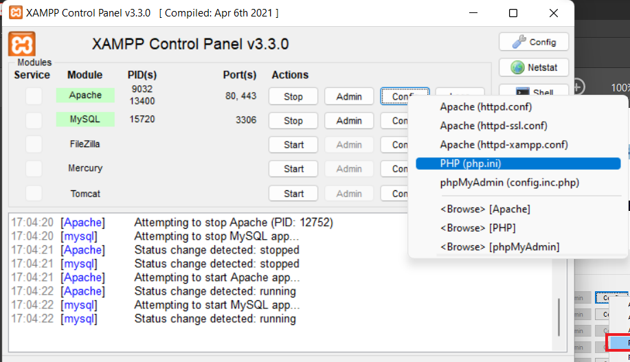<br>

Kemudian cari aktifkan extentionnya dengan menghapus tanda titik koma (;), kemudian simpan dan restart server apachenya.<br>
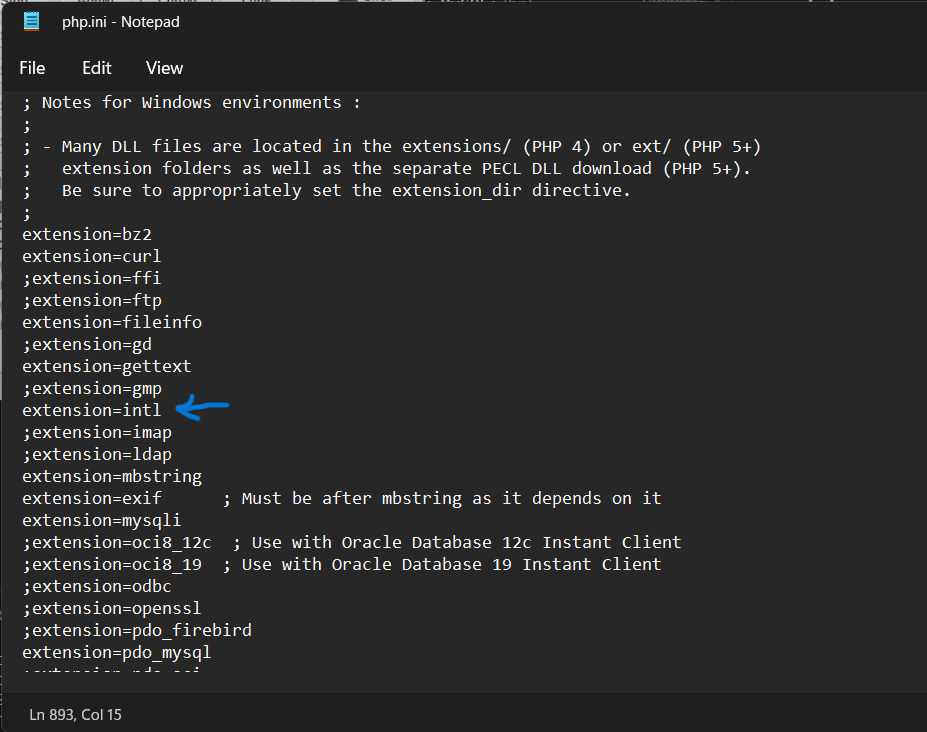<br>

### Instalasi Code Igniter 4
Setelah selesai, download Code Igniter dari web https://codeigniter.com/download. Kemudian extract file tersebut dan akan saya rename foldernya menjadi <b>ci4</b> dan saya pindahkan file kedalam folder <b>lab11ci</b>. Setelah itu saya coba dengan membuka <i><b>localhost/lab11ci/ci4/public</i></b><br>
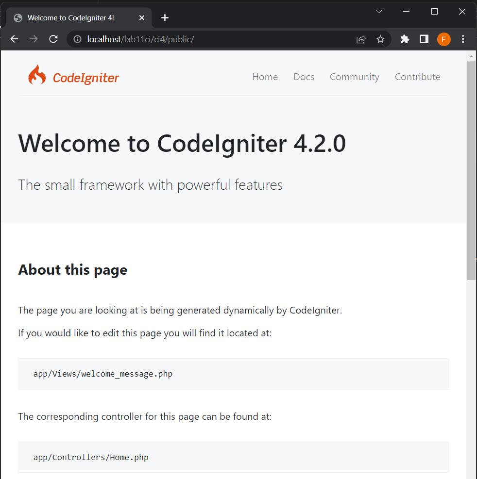<br>

### Menjalankan Spark pada CLI
Codeigniter 4 menyediakan CLI untuk mempermudah proses development. Untuk mengakses CLI buka terminal/command prompt pada panel XAMPP atau windows.<br>
Disini saya pindahkan ke direktori sesuai dengan direktori project.<br>
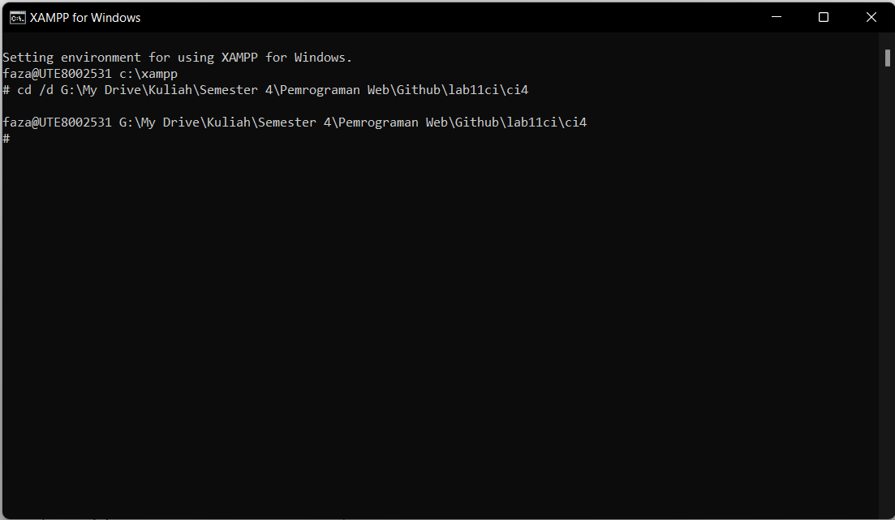<br>

Setelah pindah ke direktori project, maka saya masukan 
```
php spark
```
Tampilannya seperti berikut :<br>
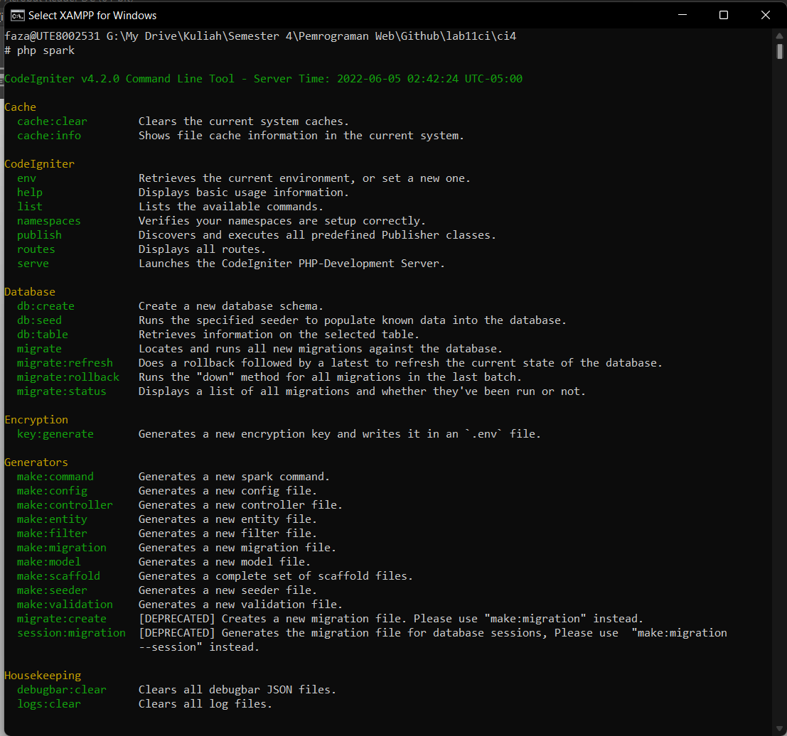<br>

### Mengaktifkan mode debugging
Codeigniter 4 menyediakan fitur debugging untuk memudahkan developer untuk mengetahui pesan error apabila terjadi kesalahan dalam membuat kode program.<br>
Bila belum aktif maka tampilanya ketika terjadi kesalahan seperti berikut.<br>
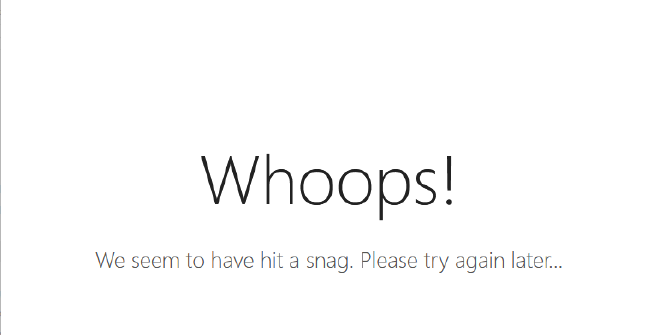<br>
Untuk mengaktifkannya silahkan ubah nama file yang sebelumnya nama file <b>env</b> dirubah menjadi <b>.env</b>. kemudian rubah variable pada CI_ENVIRONMENT menjadi development.<br>
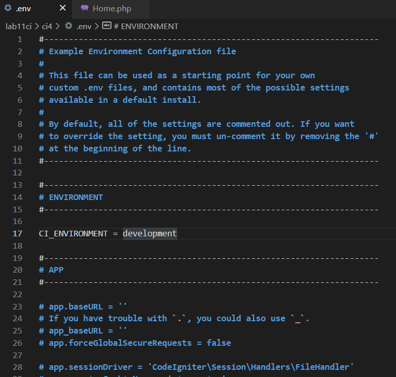<br>
Kemudian untuk mengetahuinya, saya akan rubah file Home.php menjadi error. hasilnya <br>
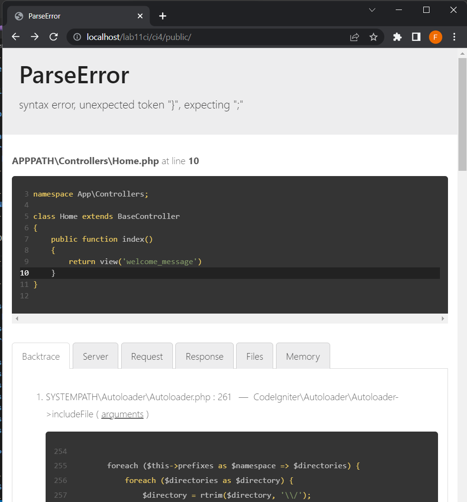<br>
Disini dijelaskan bahwa ada kesalahan dan disebutkan dimana letaknya.<br>

### Membuat Routes
Setelah semua selesai, disini saya akan membuat route baru. File Router terletak pada file <b>app/config/Routes.php</b> Disini saya membuat 3 rute baru<br>
```
$routes->get('/about', 'Page::about'); 
$routes->get('/contact', 'Page::contact'); 
$routes->get('/faqs', 'Page::faqs');
```

Untuk cek apakah route yang ditambahkan sudah benar, bisa di cek melalui CLI dan jalankan perintah berikut :<br>
```
php spark routes
```
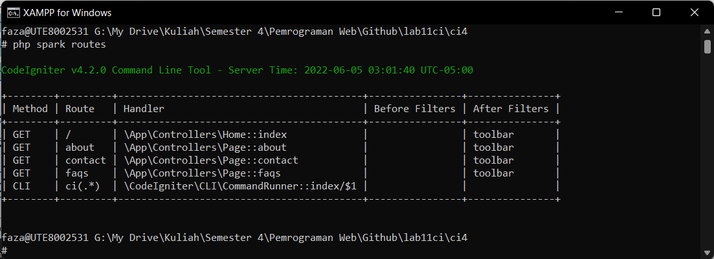<br>

Kemudian saya cek di web, untuk about tampilannya seperti berikut :<br>
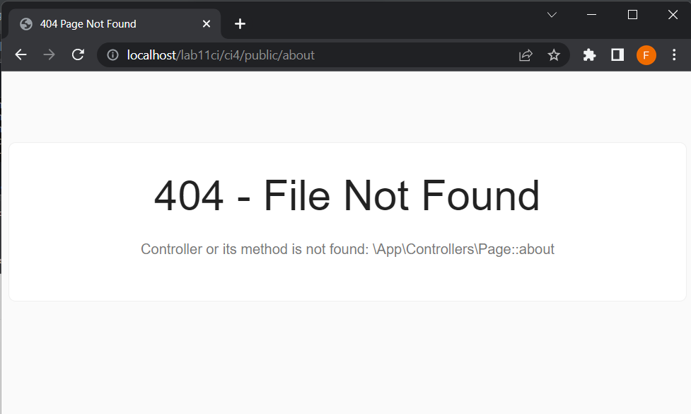<br>

### Membuat Controller
Saya membuat file baru dengan nama <b>page.php</b> pada direktori <b>Controller</b> dengan syntax berikut :<br>
```
<?php 
namespace App\Controllers; 
class Page extends BaseController 
{ 
    public function about() 
    { 
        echo "Ini halaman About"; 
    } 
    public function contact() 
    { 
        echo "Ini halaman Contact"; 
    } 
    public function faqs() 
    { 
        echo "Ini halaman FAQ"; 
    } 
}
```

Kemudian saya buka kembali untuk halaman aboutnya.<br>
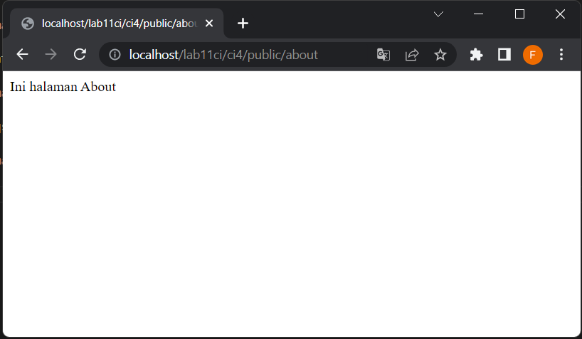<br>

### Membuat Auto Routing
Secara default fitur autoroute pada Codeiginiter sudah aktif. Untuk mengubah status autoroute dapat mengubah nilai variabelnya. Disini saya kan menambahkan pada route.
```
$routes->setAutoRoute(true);
```
Kemudian saya tambahkan method baru pada Controller<br>
```
    public function tos()
    {
        echo "Ini Halaman Term of Services";
    }
```
Tampilannya<br>
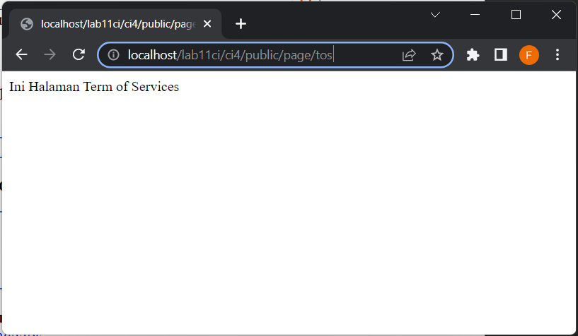<br>

### Membuat View
Selanjutnya saya akan membuat view supaya tampilan web lebih menarik. Disini saya membuat file baru yaitu <b>about.php</b> pada direktory <b>app/view</b>, dengan syntax berikut :<br>
```
<!DOCTYPE html>
<html lang="en">
<head>
    <meta charset="UTF-8">
    <meta http-equiv="X-UA-Compatible" content="IE=edge">
    <meta name="viewport" content="width=device-width, initial-scale=1.0">
    <title><?= $title; ?></title>
</head>
<body>
    
    <h1><?= $title; ?></h1>
        <hr>
    <p><?= $content; ?></p>

</body>
</html>
```
Setelah itu rubah method about pada class Controller Page menjadi berikut :<br>
```
    public function about(){
        return view('about', [
            'title' => 'Halaman About',
            'content' => 'Ini adalah Halaman About yang menjelaskan tentang isi halaman, dibuat melalui Views'
        ]);
    }
```
Tampilannya menjadi seperti berikut :<br>
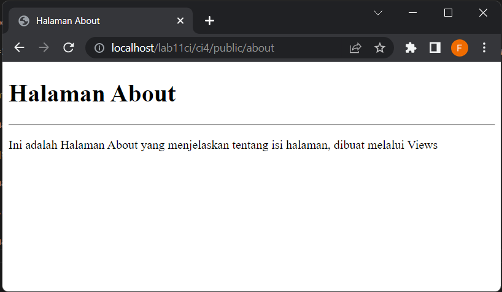

### Membuat Layout Web dengan CSS
Disini saya akan lebih merubah tampilan Website dengan menambahkan CSS. Untuk menambahkan CSS bisa diletakkan pada folder public. Tapi disini untuk CSS saya jadikan satu di dalamnya. Disini saya membuat folder baru dengan nama <b>template</b> dan membuat beberapa bagian template dibagi menjadi dua, yaitu <b>Header</b> dan <b>Footer</b>.

Pertama saya akan membuat file header.php dengan syntax berikut :<br>
```
<!DOCTYPE html>
<html lang="en">
<head>
    <meta charset="UTF-8">
    <meta http-equiv="X-UA-Compatible" content="IE=edge">
    <meta name="viewport" content="width=device-width, initial-scale=1.0">
    <title><?= $title; ?></title>

    <link rel="stylesheet" href="https://cdn.jsdelivr.net/npm/bootstrap@4.3.1/dist/css/bootstrap.min.css">
    <script src="https://cdn.jsdelivr.net/npm/bootstrap@4.3.1/dist/js/bootstrap.min.js"></script>
    <style rel="stylesheet">
    * {
    margin: 0;
    padding: 0;
    }
    body {
        line-height:1;
        font-size:100%;
        font-family:'Open Sans', sans-serif;
        color:#5a5a5a;
    }
    /* header */
    header {
        padding: 20px;
    }
    header h1 {
        margin: 20px 10px;
        color: #b5b5b5;
    }
    </style>
    
</head>
<body>

<div class="container" style="box-shadow: 0 0 1em #cccccc">
    <div class="row">
        <header>
            <h1>Layout Sederhana</h1>
        </header>
    </div>
    <div class="row">
        <nav class="navbar navbar-collapse navbar-expand navbar-dark bg-primary">
            <div class="container-fluid">
                <div class="collapse navbar-collapse">
                    <ul class="navbar-nav" style="font-size: 14px; font-weight: bold;">
                        <li class="nav-item" style="padding-right: 15px;">
                            <a class="nav-link active" href="/">Home</a>
                        </li>
                        <li class="nav-item" style="padding-right: 15px;">
                            <a class="nav-item">
                                <a href="article" class="nav-link">Article</a>
                            </a>
                        </li>
                        <li class="nav-item" style="padding-right: 15px;">
                            <a class="nav-item">
                                <a href="about" class="nav-link">About</a>
                            </a>
                        </li>
                        <li class="nav-item" style="padding-right: 15px;">
                            <a class="nav-item">
                                <a href="contact" class="nav-link">Contact</a>
                            </a>
                        </li>
                    </ul>
                </div>
            </div>
        </nav>
    </div> <br>
    <div class="row">
```

Kemudian saya membuat file footer dengan syntax berikut :<br>
```
<div class="col col-4">
            <ul class="list-group">
                <li class="list-group-item active fw-bolder" aria-current="true">Widget Header</li>
                <li class="list-group-item">Widget Link</li>
                <li class="list-group-item">Widget Link</li>
            </ul>

            <br><br>

            <div class="card mb-3" style="max-width: 18rem;">
                <div class="card-header text-white bg-primary fw-bolder">Widget Text</div>
                <div class="card-body">
                  Lorem ipsum dolor sit amet consectetur adipisicing elit. Ipsum quidem vitae mollitia suscipit dolores non deleniti, quis autem reiciendis eos, labore iure nam facilis minus id laborum maiores laboriosam ipsam?
                </div>
            </div>
        </div>
    </div>
    <div class="row">
        <div class="col-sm-12">
            <div class="card text-white bg-dark mb-1">
                <div class="card-body">
                    &copy; 2022 - Universitas Pelita Bangsa
                </div>
            </div>
        </div>
    </div>
</div>

</body>
</html>
```

Setelah itu saya akan mencobanya pada halaman about. Disini saya akan mengedit halaman about.<br>
```
<?= $this->include('template/header'); ?>

<div class="col-sm-8">
    <h1 style="font-weight: bold;"><?= $title; ?></h1>
        <hr>
    <p><?= $content; ?></p>
</div>
<?= $this->include('template/footer'); ?>
```

Tampilannya menjadi seperti berikut :<br>
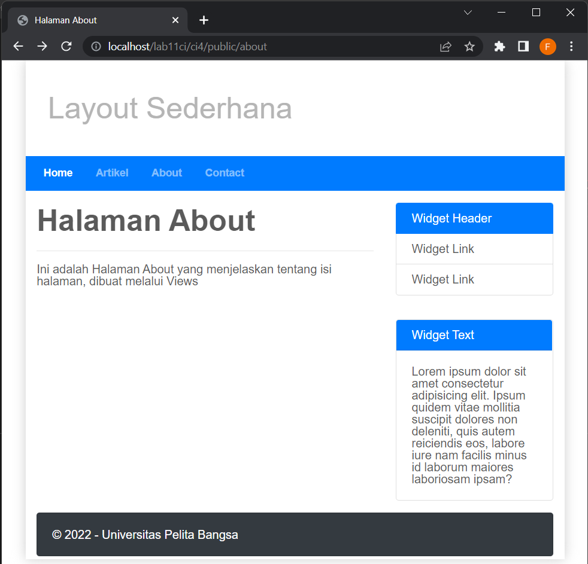<br>

