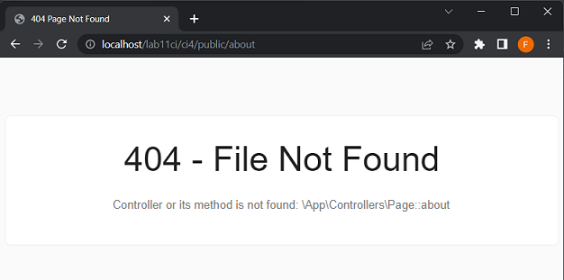

# lab11_ci
## Lab11 Code Igniter
<hr>
Nama : Faza Ardan Kusuma<br>
NIM : 312010001<br>
Kelas : TI 20 B1<br>
<hr>
Disini saya akan melaksanakan instruksi latihan dan tugas sesuai dengan modul Praktikum 11. Pada praktikum kali ini akan menggunakan Framework Code Igniter(CI). <br>

### Preparasi
Disini saya menggunakan <b>XAMMP</b>, maka dari itu sebelum memulai menggunakan Framework Codeigniter, perlu dilakukan konfigurasi pada webserver. Beberapa ekstensi PHP perlu diaktifkan untuk kebutuhan pengembangan Codeigniter 4.
Berikut beberapa ekstensi yang perlu diaktifkan:<br>
• <b>php-json</b> ekstension untuk bekerja dengan JSON;<br>
• <b>php-mysqlnd</b> native driver untuk MySQL;<br>
• <b>php-xml</b> ekstension untuk bekerja dengan XML;<br>
• <b>php-intl</b> ekstensi untuk membuat aplikasi multibahasa;<br>
• <b>libcurl (opsional)</b>, jika ingin pakai Curl.<br>
Pertama saya aktifkan ekstensi tersebut pada <b>XAMPP Control Panel</b>, pada bagian <b>Apache</b>, klik <b>Config > PHP(php.ini)</b>.<br>
<br>

Kemudian cari aktifkan extentionnya dengan menghapus tanda titik koma (;), kemudian simpan dan restart server apachenya.<br>
<br>

### Instalasi Code Igniter 4
Setelah selesai, download Code Igniter dari web https://codeigniter.com/download. Kemudian extract file tersebut dan akan saya rename foldernya menjadi <b>ci4</b> dan saya pindahkan file kedalam folder <b>lab11ci</b>. Setelah itu saya coba dengan membuka <i><b>localhost/lab11ci/ci4/public</i></b><br>
<br>

### Menjalankan Spark pada CLI
Codeigniter 4 menyediakan CLI untuk mempermudah proses development. Untuk mengakses CLI buka terminal/command prompt pada panel XAMPP atau windows.<br>
Disini saya pindahkan ke direktori sesuai dengan direktori project.<br>
<br>

Setelah pindah ke direktori project, maka saya masukan 
```
php spark
```
Tampilannya seperti berikut :<br>
<br>

### Mengaktifkan mode debugging
Codeigniter 4 menyediakan fitur debugging untuk memudahkan developer untuk mengetahui pesan error apabila terjadi kesalahan dalam membuat kode program.<br>
Bila belum aktif maka tampilanya ketika terjadi kesalahan seperti berikut.<br>
<br>
Untuk mengaktifkannya silahkan ubah nama file yang sebelumnya nama file <b>env</b> dirubah menjadi <b>.env</b>. kemudian rubah variable pada CI_ENVIRONMENT menjadi development.<br>
<br>
Kemudian untuk mengetahuinya, saya akan rubah file Home.php menjadi error. hasilnya <br>
<br>
Disini dijelaskan bahwa ada kesalahan dan disebutkan dimana letaknya.<br>

### Membuat Routes
Setelah semua selesai, disini saya akan membuat route baru. File Router terletak pada file <b>app/config/Routes.php</b> Disini saya membuat 3 rute baru<br>
```
$routes->get('/about', 'Page::about'); 
$routes->get('/contact', 'Page::contact'); 
$routes->get('/faqs', 'Page::faqs');
```

Untuk cek apakah route yang ditambahkan sudah benar, bisa di cek melalui CLI dan jalankan perintah berikut :<br>
```
php spark routes
```
<br>

Kemudian saya cek di web, untuk about tampilannya seperti berikut :<br>
<br>

### Membuat Controller
Saya membuat file baru dengan nama <b>page.php</b> pada direktori <b>Controller</b> dengan syntax berikut :<br>
```
<?php 
namespace App\Controllers; 
class Page extends BaseController 
{ 
    public function about() 
    { 
        echo "Ini halaman About"; 
    } 
    public function contact() 
    { 
        echo "Ini halaman Contact"; 
    } 
    public function faqs() 
    { 
        echo "Ini halaman FAQ"; 
    } 
}
```